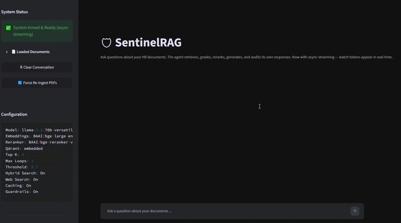

<div align="center">

# 🛡️ SentinelRAG v2.1

### Self-Correcting Agentic RAG System with Hybrid Search

*An intelligent retrieval-augmented generation pipeline that validates, corrects, and refines its own outputs through a multi-stage agent workflow — now with cross-encoder reranking, BM25 hybrid search, web fallback, input guardrails, and real-time streaming.*

[](https://www.python.org/)
[](https://langchain-ai.github.io/langgraph/)
[](https://streamlit.io/)
[](https://groq.com/)
[](https://qdrant.tech/)
[](LICENSE)

---

**SentinelRAG** goes beyond naive retrieve-and-generate. It implements a **self-correcting agentic loop** — documents are graded for relevance, queries are intelligently rewritten when context is insufficient, generated answers are audited for hallucinations, and the entire decision trail is exposed through a transparent audit interface.

[Features](#-features) · [Architecture](#-architecture) · [Quick Start](#-quick-start) · [How It Works](#-how-it-works) · [Tech Stack](#-tech-stack) · [Evaluation](#-evaluation) · [License](#-license)

<br>

<div align="center">
  
</div>

</div>

---

## ✨ Features

**What's new in v2.1:**
- 🔀 **Hybrid dense+sparse retrieval** — combines Qdrant vector search with BM25 for better keyword recall
- 🎯 **Real cross-encoder reranking** — BGE-reranker-v2-m3 replaces slow LLM-based reranking
- 🌐 **Web search fallback** — Tavily integration when local documents are insufficient
- 🛡️ **Input guardrails** — prompt injection detection, length limits, homoglyph detection
- ⚡ **Streaming generation** — token-by-token real-time display
- 📊 **RAGAS evaluation** — faithfulness, context precision/recall, answer relevancy metrics
- 📈 **Self-play evaluation** — auto-generate test questions from your documents
- ⏱️ **Rate limiting** — sliding-window protection for API usage
- 🔍 **LangFuse tracing** — optional observability for production deployments

---

## 🏗 Architecture

The core of SentinelRAG is a **stateful LangGraph workflow** where each node performs a discrete reasoning task and conditional edges route execution based on evaluation outcomes.

```mermaid
graph TD
    A["📥 User Query"] --> G["🛡️ Guardrails"]
    G -->|"Passed"| B["🔎 Hybrid Retrieve<br/>(Dense + BM25)"]
    G -->|"Blocked"| X["❌ Reject"]
    B --> C["📋 Grade Documents"]
    C -->|"Relevant docs found"| D["🎯 Cross-Encoder Rerank"]
    C -->|"All irrelevant"| E["🌐 Web Search (Tavily)"]
    C -->|"All irrelevant + no web"| F["🔄 Rewrite Query"]
    E --> C
    F --> B
    D --> H["⚡ Generate (Streaming)"]
    H --> I["🛡️ Hallucination Check"]
    I --> J["📚 Extract Citations"]
    J --> K["✅ Finalize Response"]

    style A fill:#6366f1,stroke:#4f46e5,color:#fff
    style B fill:#3b82f6,stroke:#2563eb,color:#fff
    style C fill:#f59e0b,stroke:#d97706,color:#fff
    style D fill:#8b5cf6,stroke:#7c3aed,color:#fff
    style E fill:#14b8a6,stroke:#0d9488,color:#fff
    style F fill:#ef4444,stroke:#dc2626,color:#fff
    style H fill:#8b5cf6,stroke:#7c3aed,color:#fff
    style I fill:#ec4899,stroke:#db2777,color:#fff
    style J fill:#14b8a6,stroke:#0d9488,color:#fff
    style K fill:#22c55e,stroke:#16a34a,color:#fff
```



### Decision Logic

| Checkpoint | Condition | Route |
|---|---|---|
| **Guardrails** | Input passes all safety checks | → Retrieve |
| **Guardrails** | Blocked pattern / too long / homoglyphs | → Reject |
| **Post-Grading** | Relevant documents found | → Rerank (cross-encoder) |
| **Post-Grading** | All docs irrelevant + web enabled | → Web Search (Tavily) |
| **Post-Grading** | All docs irrelevant + web disabled | → Rewrite Query |
| **Post-Grading** | Max loop count reached | → Rerank (best available) |
| **Post-Reranking** | Cross-encoder scoring complete | → Generate |
| **Post-Generation** | Hallucination audit + citations | → Finalize |

---

## 🚀 Quick Start

### Prerequisites

- **Python 3.10+**
- **Groq API key** — for LLM inference ([get free key](https://console.groq.com))
- *(Optional)* **Tavily API key** — for web search fallback ([get free key](https://tavily.com))

### 1. Clone the Repository

```bash
git clone https://github.com/your-username/SentinelRAG.git
cd SentinelRAG
```

### 2. Create a Virtual Environment

```bash
python -m venv .venv
source .venv/bin/activate  # macOS/Linux
# or: .venv\Scripts\activate  (Windows)
```

### 3. Install Dependencies

```bash
pip install -r requirements.txt
```

### 4. Configure Environment Variables

Create a `.env` file in the project root:

```env
# Required — LLM (Groq, free tier: 14,400 req/day)
GROQ_API_KEY=gsk_your_groq_key_here

# Optional — Web search fallback
TAVILY_API_KEY=tvly_your_tavily_key_here

# Optional — Fallback LLM
GEMINI_API_KEY=your_gemini_key_here

# Optional — Observability
LANGFUSE_PUBLIC_KEY=pk-lf-...
LANGFUSE_SECRET_KEY=sk-lf-...
ENABLE_TRACING=false
```

### 5. Add Your Documents

Place PDF files into `data/raw/`:

```
data/
└── raw/
    ├── company_handbook.pdf
    ├── technical_docs.pdf
    └── ...
```

On first launch, the pipeline automatically:
1. Parses PDFs with PyMuPDF
2. Chunks text intelligently
3. Generates local embeddings (BAAI/bge-large-en-v1.5)
4. Stores vectors in embedded Qdrant
5. Builds BM25 sparse index for hybrid search

### 6. Launch

```bash
streamlit run ui/streamlit_app.py
```

Open `http://localhost:8501` and start asking questions!

### 🐳 Docker

```bash
docker-compose up --build
```

This starts:
- **Qdrant** — vector database on port `6333`
- **SentinelRAG App** — Streamlit UI on port `8501`

---

## 🔬 How It Works

### Stage 1 — Guardrails (NEW)
User input is validated against blocked patterns (prompt injection attempts), length limits, and Unicode homoglyph detection before entering the pipeline.

### Stage 2 — Hybrid Retrieve (NEW)
The query is run against both:
- **Dense** — Qdrant vector similarity (local BGE embeddings)
- **Sparse** — BM25 keyword matching

Results are merged via reciprocal rank fusion with configurable weights (default 70% dense, 30% BM25).

### Stage 3 — Grade Documents
Each chunk is evaluated by Groq (Llama 3.3 70B) acting as a relevance auditor. Chunks below the similarity threshold are dropped.

### Stage 4a — Rewrite Query
If all chunks are irrelevant, the query is rewritten using a rotating strategy (Semantic → Keyword → Hybrid → Expansion) and re-retrieved.

### Stage 4b — Web Search (NEW)
When all chunks are irrelevant and Tavily is configured, the pipeline searches the web for relevant context and grades those results too.

### Stage 5 — Cross-Encoder Rerank (NEW)
Remaining documents are re-scored with `BAAI/bge-reranker-v2-m3` — a proper cross-encoder that's faster, cheaper, and more accurate than LLM-based reranking.

### Stage 6 — Generate (Streaming)
Groq synthesizes a grounded response. The UI receives tokens in real-time for a streaming chat experience.

### Stage 7 — Hallucination Detection
A separate LLM pass audits every claim against source documents, producing a grounding score and a list of all unsupported claims.

### Stage 8 — Citations + Finalize
Structured source citations with confidence scores are extracted. The complete audit trail is assembled for display.

---

## 🛠 Tech Stack

| Layer | Technology | Purpose |
|---|---|---|
| **Orchestration** | [LangGraph](https://langchain-ai.github.io/langgraph/) | Stateful agent workflow with conditional routing |
| **LLM Inference** | [Groq](https://groq.com/) + Llama 3.3 70B | Generation, grading, hallucination detection |
| **LLM Fallback** | [Gemini 2.5 Flash](https://deepmind.google/) | Optional secondary LLM |
| **Embeddings** | [BAAI/bge-large-en-v1.5](https://huggingface.co/BAAI/bge-large-en-v1.5) | Local dense embeddings (free, no API key) |
| **Reranker** | [BGE-reranker-v2-m3](https://huggingface.co/BAAI/bge-reranker-v2-m3) | Cross-encoder relevance scoring |
| **Hybrid Search** | BM25 (custom) + Qdrant | Sparse + dense reciprocal rank fusion |
| **Vector Store** | [Qdrant](https://qdrant.tech/) | Embedded (local) or server mode |
| **Web Search** | [Tavily](https://tavily.com/) | Real-time web fallback |
| **Framework** | [LangChain](https://www.langchain.com/) | Prompt templates, structured outputs |
| **Validation** | [Pydantic](https://docs.pydantic.dev/) | Typed settings, structured schemas |
| **UI** | [Streamlit](https://streamlit.io/) | Chat interface with streaming |
| **PDF Parsing** | [PyMuPDF](https://pymupdf.readthedocs.io/) | High-performance PDF extraction |
| **Tracing** | [LangFuse](https://langfuse.com/) | Optional production observability |
| **CI/CD** | [GitHub Actions](https://github.com/features/actions) | Automated pytest |

---

## 📈 Evaluation

Run the RAGAS evaluation suite to benchmark your pipeline:

```python
from evaluation.ragas_eval import RAGASEvaluator

evaluator = RAGASEvaluator()
evaluator.add_sample(
    question="What is the leave policy?",
    generated_answer="...",
    context_docs=["..."],
    hallucinated_claims=[],
)
report = evaluator.evaluate()
print(f"Composite RAGAS Score: {report.composite_score:.2f}")
evaluator.save_report("eval_report.json")
```

Generate self-play test questions from your documents:

```python
from evaluation.ragas_eval import generate_self_play_questions

questions = generate_self_play_questions(documents, num_questions=20)
```

---

## ⚙️ Configuration

All parameters managed via `src/config.py`, overridable via environment variables:

| Parameter | Default | Description |
|---|---|---|
| `GROQ_API_KEY` | — | **Required** — Groq API key |
| `TAVILY_API_KEY` | — | Optional — Tavily web search key |
| `MAX_LOOP_COUNT` | `3` | Max query rewrite iterations |
| `TOP_K_DOCUMENTS` | `5` | Chunks retrieved per query |
| `SIMILARITY_THRESHOLD` | `0.7` | Min relevance score to keep |
| `ENABLE_HYBRID_SEARCH` | `true` | BM25 + dense fusion |
| `ENABLE_WEB_SEARCH` | `true` | Tavily fallback |
| `ENABLE_CROSS_ENCODER` | `true` | Real cross-encoder reranking |
| `ENABLE_GUARDRAILS` | `true` | Input validation |
| `ENABLE_TRACING` | `false` | LangFuse observability |
| `BM25_WEIGHT` | `0.3` | BM25 weight in hybrid fusion |
| `DENSE_WEIGHT` | `0.7` | Dense weight in hybrid fusion |
| `RATE_LIMIT_REQUESTS` | `30` | Max requests per window |
| `RATE_LIMIT_WINDOW_SECONDS` | `60` | Rate limit window |

---

## 🧪 Running Tests

```bash
pytest
```

---

## 📜 License

MIT License — see [LICENSE](LICENSE).

---

<div align="center">

**Built with conviction that AI systems should explain their reasoning, not just deliver answers.**

<sub>SentinelRAG v2.1 — Retrieve. Validate. Correct. Generate.</sub>

</div>
