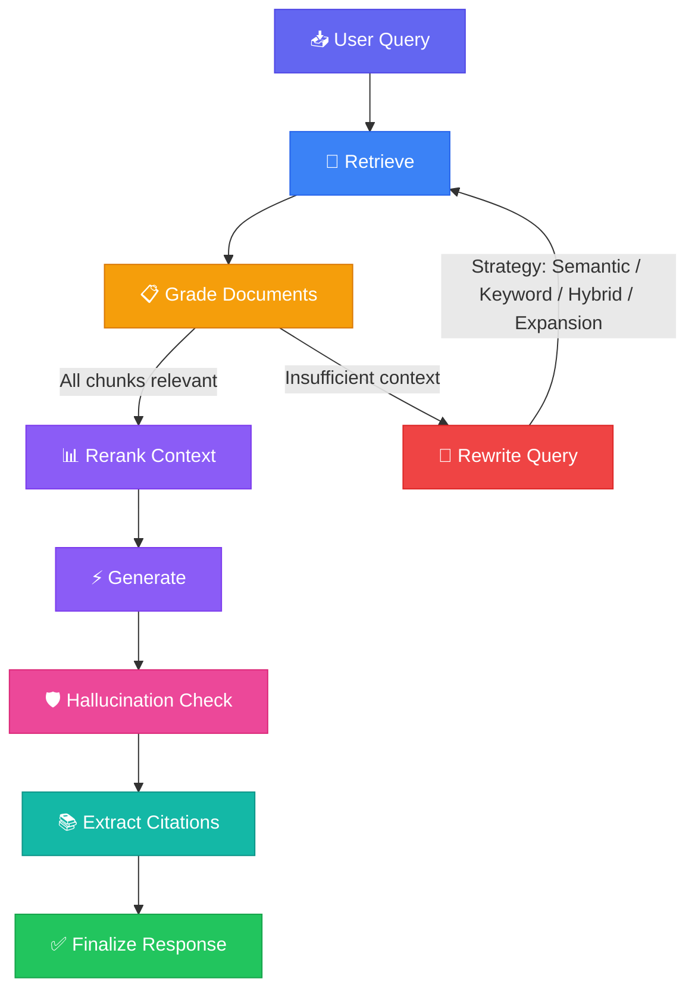

<div align="center">

# 🛡️ SentinelRAG

### Self-Correcting Agentic RAG System

*An intelligent retrieval-augmented generation pipeline that validates, corrects, and refines its own outputs through a multi-stage agent workflow.*

[](https://www.python.org/)
[](https://langchain-ai.github.io/langgraph/)
[](https://streamlit.io/)
[](https://x.ai/)
[](https://qdrant.tech/)
[](LICENSE)

---

**SentinelRAG** goes beyond naive retrieve-and-generate. It implements a **self-correcting agentic loop** — documents are graded for relevance, queries are intelligently rewritten when context is insufficient, generated answers are audited for hallucinations, and the entire decision trail is exposed through a transparent audit interface.

[Features](#-features) · [Architecture](#-architecture) · [Quick Start](#-quick-start) · [How It Works](#-how-it-works) · [Tech Stack](#-tech-stack) · [Project Structure](#-project-structure) · [License](#-license)

</div>

---

## ✨ Features

<table>
<tr>
<td width="50%">

### 🧠 Intelligent Retrieval
- Semantic similarity search over embedded PDF documents
- Configurable top-k retrieval with scored rankings
- Embedded Qdrant vector store — **zero Docker dependency** for local development

</td>
<td width="50%">

### 🔄 Self-Correcting Pipeline
- LLM-powered document relevance grading with structured Pydantic outputs
- Automatic query rewriting when retrieved context is insufficient
- Configurable loop limits to prevent infinite correction cycles

</td>
</tr>
<tr>
<td width="50%">

### 🔍 Hallucination Detection
- Post-generation grounding audit against source documents
- Quantified grounding scores (0.0 – 1.0) with detailed reasoning
- Explicit identification of unsupported claims in generated responses

</td>
<td width="50%">

### 🎯 Multi-Strategy Query Rewriting
- **Semantic** — rewrites to maximize meaning overlap with documents
- **Keyword** — extracts and reorders critical terms by importance
- **Hybrid** — combines keyword precision with semantic breadth
- **Expansion** — enriches queries with synonyms and related concepts

</td>
</tr>
<tr>
<td width="50%">

### 📊 Full Observability
- Streamlit chat UI with expandable **Agent Audit Trail**
- Per-query metrics: retrieval scores, grading rationale, strategy used
- Complete execution time tracking per interaction
- **NEW:** Source citation display with confidence scores
- **NEW:** User feedback (thumbs up/down) on responses

</td>
<td width="50%">

### 📄 PDF Ingestion Pipeline
- Automated PDF parsing with PyMuPDF (fitz)
- Intelligent document chunking for optimal retrieval
- Idempotent ingestion — skips already-processed documents automatically

</td>
</tr>
</table>

---

## 🏗 Architecture

The core of SentinelRAG is a **stateful LangGraph workflow** where each node performs a discrete reasoning task and conditional edges route execution based on evaluation outcomes.



### Decision Logic

| Checkpoint | Condition | Route |
|---|---|---|
| **Post-Grading** | All documents graded irrelevant | → Rewrite Query (rotate strategy) |
| **Post-Grading** | Relevant documents found | → Rerank Context |
| **Post-Grading** | Max loop count reached | → Rerank Context (force with best available context) |
| **Post-Reranking** | Reranking complete | → Generate Response |
| **Post-Generation** | Grounding audit + citations extracted | → Finalize Response |

---

## 🚀 Quick Start

### Prerequisites

- **Python 3.10+**
- **xAI API key** — for Grok LLM inference ([get one here](https://console.x.ai/))
- **OpenAI API key** — for text-embedding-3-small embeddings ([get one here](https://platform.openai.com/api-keys))

### 1. Clone the Repository

```bash
git clone https://github.com/your-username/SentinelRAG.git
cd SentinelRAG
```

### 2. Create a Virtual Environment

**Windows:**
```powershell
python -m venv .venv
.venv\Scripts\activate
```

**macOS / Linux:**
```bash
python -m venv .venv
source .venv/bin/activate
```

### 3. Install Dependencies

```bash
pip install -r requirements.txt
```

### 4. Configure Environment Variables

Create a `.env` file in the project root with your API keys:

```env
# LLM — xAI Grok
XAI_API_KEY=your_xai_api_key_here

# Embeddings — OpenAI
OPENAI_API_KEY=your_openai_api_key_here
```

### 5. Add Your Documents

Place one or more PDF files into the `data/raw/` directory:

```
data/
└── raw/
    ├── company_handbook.pdf
    ├── technical_docs.pdf
    └── ...
```

The ingestion pipeline runs automatically on first launch. It parses PDFs, chunks the text, generates embeddings via OpenAI, and stores vectors locally in Qdrant's embedded mode.

### 6. Launch the Application

```bash
streamlit run ui/streamlit_app.py
```

The Streamlit UI will open at `http://localhost:8501`. Ask questions about your documents and explore the agent audit trail for full transparency into the pipeline's decision-making.

---

### 🐳 Docker (Optional)

For containerized deployment with a standalone Qdrant instance:

```bash
docker-compose up --build
```

This starts two services:
- **Qdrant** — vector database on port `6333`
- **SentinelRAG App** — Streamlit UI on port `8501`

> **Note:** When running via Docker, the app automatically connects to the Qdrant container service instead of using embedded mode.

---

## 🔬 How It Works

SentinelRAG implements a **self-correcting agentic loop** using LangGraph's `StateGraph`. Each query flows through a structured pipeline where every stage evaluates its own output before proceeding.

### Stage 1 — Retrieve

The user's query (or a rewritten variant) is used to perform a **similarity search** against the Qdrant vector store. The top-k most similar document chunks are retrieved and scored using cosine similarity.

### Stage 2 — Grade Documents

Each retrieved chunk is evaluated by an LLM acting as an **objective relevance auditor**. The grader produces a structured Pydantic output containing:
- A `relevance_score` (0.0 – 1.0)
- A binary `yes/no` grade
- A one-sentence `reasoning` justification

Chunks below the configured similarity threshold are dropped. If **all chunks are dropped**, the pipeline triggers a query rewrite.

### Stage 3 — Rewrite Query (Conditional)

When the grading stage determines that retrieved context is insufficient, the query enters a **rewriting loop**. SentinelRAG rotates through four strategies across successive iterations:

1. **Semantic** — restructures the query to maximize meaning overlap
2. **Keyword** — distills the query to its most critical terms
3. **Hybrid** — blends keyword precision with semantic context
4. **Expansion** — enriches the query with synonyms and broader concepts

After rewriting, the pipeline loops back to the retrieval stage. A configurable `max_loop_count` prevents infinite cycles.

### Stage 4 — Generate

With validated context in hand, an LLM (Grok via xAI) synthesizes a grounded response. The generation prompt explicitly instructs the model to:
- Base the answer **strictly on provided context**
- Clearly state when context is insufficient
- Never fabricate information

### Stage 5 — Hallucination Detection

The generated response undergoes a **grounding audit** where a separate LLM evaluation checks every claim against the source documents. This produces:
- A `grounded_score` (0.0 – 1.0)
- A list of specific `hallucinated_claims` identified in the output
- Detailed `reasoning` explaining the assessment

### Stage 6 — Finalize

The validated response is returned to the user along with a complete **audit trail** including retrieval metrics, grading decisions, rewrite history, strategy used, and execution time.

---

## 🛠 Tech Stack

| Layer | Technology | Purpose |
|---|---|---|
| **Orchestration** | [LangGraph](https://langchain-ai.github.io/langgraph/) | Stateful agent workflow with conditional routing |
| **LLM Inference** | [Grok (xAI)](https://x.ai/) | Response generation, document grading, hallucination detection |
| **Embeddings** | [OpenAI](https://platform.openai.com/) | `text-embedding-3-small` for high-quality vector representations |
| **Vector Store** | [Qdrant](https://qdrant.tech/) | Embedded (local) mode for development, containerized for production |
| **Framework** | [LangChain](https://www.langchain.com/) | Prompt templates, structured outputs, LLM abstractions |
| **Validation** | [Pydantic](https://docs.pydantic.dev/) | Typed settings, structured grading/hallucination schemas |
| **UI** | [Streamlit](https://streamlit.io/) | Chat interface with audit trail visualization |
| **PDF Parsing** | [PyMuPDF](https://pymupdf.readthedocs.io/) | High-performance PDF text extraction |
| **CI/CD** | [GitHub Actions](https://github.com/features/actions) | Automated test execution via pytest |

---

## 📁 Project Structure

```
SentinelRAG/
│
├── src/                          # Core pipeline logic
│   ├── config.py                 # Pydantic settings — API keys, model params, thresholds
│   ├── state.py                  # AgentState TypedDict, GradeDocument, GradeHallucination schemas
│   ├── nodes.py                  # LangGraph nodes — retrieve, grade, rewrite, generate, detect
│   ├── edges.py                  # Conditional routing — post-grading and post-generation logic
│   ├── pipeline.py               # LangGraph StateGraph assembly and compilation
│   ├── evaluators.py             # Retrieval and generation quality metrics
│   ├── utils.py                  # Caching, similarity computation, document chunking
│   └── exceptions.py             # Custom exception hierarchy
│
├── ui/
│   └── streamlit_app.py          # Streamlit chat interface with audit trail
│
├── ingestion/
│   └── load_documents.py         # PDF ingestion, chunking, and Qdrant storage
│
├── tests/
│   ├── test_nodes.py             # Unit tests for pipeline nodes
│   ├── test_edges.py             # Unit tests for routing logic
│   ├── test_pipeline.py          # Integration tests for the full workflow
│   ├── test_utils.py             # Tests for utilities (caching, chunking, retry)
│   └── test_evaluators.py        # Tests for retrieval and generation metrics
│
├── data/
│   └── raw/                      # Place your PDF documents here
│
├── docker/
│   └── Dockerfile                # Container build instructions
│
├── .github/workflows/
│   └── pytest.yml                # CI pipeline configuration
│
├── docker-compose.yml            # Multi-service Docker orchestration
├── requirements.txt              # Python dependencies
├── pytest.ini                    # Test runner configuration
├── .env                          # Environment variables (not committed)
└── .gitignore                    # Git exclusion rules
```

---

## 🧪 Running Tests

```bash
pytest
```

Tests cover individual node behavior, conditional edge routing logic, and end-to-end pipeline execution.

---

## ⚙️ Configuration

All operational parameters are managed through Pydantic `Settings` in `src/config.py` and can be overridden via environment variables:

| Parameter | Default | Description |
|---|---|---|
| `LLM_MODEL` | `grok-3-beta` | xAI model used for generation and grading |
| `EMBEDDING_MODEL` | `text-embedding-3-small` | OpenAI model for embeddings |
| `MAX_LOOP_COUNT` | `3` | Maximum query rewrite iterations |
| `TOP_K_DOCUMENTS` | `5` | Number of chunks retrieved per query |
| `SIMILARITY_THRESHOLD` | `0.7` | Minimum relevance score to keep a document |
| `TEMPERATURE_DETERMINISTIC` | `0.0` | LLM temperature for grading / hallucination checks |
| `TEMPERATURE_CREATIVE` | `0.3` | LLM temperature for query rewriting |
| `ENABLE_CACHING` | `true` | Cache LLM calls to reduce cost and latency |
| `CACHE_TTL_SECONDS` | `3600` | Cache time-to-live in seconds |

---

## 📜 License

This project is licensed under the **MIT License**.

```
MIT License

Copyright (c) 2025 SentinelRAG

Permission is hereby granted, free of charge, to any person obtaining a copy
of this software and associated documentation files (the "Software"), to deal
in the Software without restriction, including without limitation the rights
to use, copy, modify, merge, publish, distribute, sublicense, and/or sell
copies of the Software, and to permit persons to whom the Software is
furnished to do so, subject to the following conditions:

The above copyright notice and this permission notice shall be included in all
copies or substantial portions of the Software.

THE SOFTWARE IS PROVIDED "AS IS", WITHOUT WARRANTY OF ANY KIND, EXPRESS OR
IMPLIED, INCLUDING BUT NOT LIMITED TO THE WARRANTIES OF MERCHANTABILITY,
FITNESS FOR A PARTICULAR PURPOSE AND NONINFRINGEMENT. IN NO EVENT SHALL THE
AUTHORS OR COPYRIGHT HOLDERS BE LIABLE FOR ANY CLAIM, DAMAGES OR OTHER
LIABILITY, WHETHER IN AN ACTION OF CONTRACT, TORT OR OTHERWISE, ARISING FROM,
OUT OF OR IN CONNECTION WITH THE SOFTWARE OR THE USE OR OTHER DEALINGS IN THE
SOFTWARE.
```

---

<div align="center">

**Built with conviction that AI systems should explain their reasoning, not just deliver answers.**

<sub>SentinelRAG — Retrieve. Validate. Correct. Generate.</sub>

</div>
