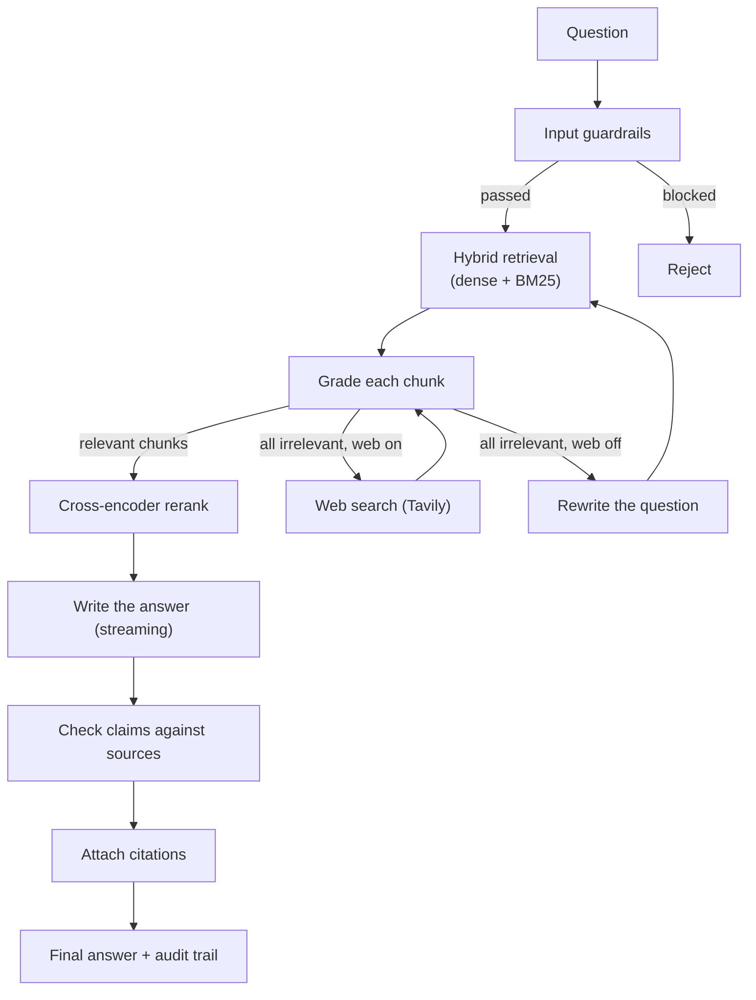

# SentinelRAG

[](https://www.python.org/)
[](https://langchain-ai.github.io/langgraph/)
[](https://qdrant.tech/)
[](LICENSE)

A plain RAG system retrieves some chunks and writes an answer, even when the chunks are
irrelevant or the answer goes beyond them. I built SentinelRAG to check itself at each
step instead: it grades what it retrieved, rewrites the question or searches the web
when retrieval fails, and after writing the answer it checks every claim against the
sources and lists the ones it can't support.

<p align="center">
  
</p>

## How it works

The pipeline is a LangGraph workflow: each node does one job, and the next step
depends on what the previous check found.



1. **Input guardrails.** I check the question for prompt-injection patterns, length and
   Unicode look-alike characters (homoglyphs) before it reaches the pipeline.
2. **Hybrid retrieval.** The question runs against Qdrant (local BGE embeddings) and a
   BM25 keyword index; I merge the two with reciprocal rank fusion (70% dense, 30%
   BM25 by default).
3. **Grading.** Llama 3.3 70B (on Groq) grades each chunk for relevance, and I drop the
   ones below the threshold.
4. **Recovery.** If every chunk is irrelevant, it either searches the web with Tavily
   and grades those results too, or rewrites the question (semantic, keyword, hybrid,
   then expansion) and retrieves again, up to 3 times.
5. **Reranking.** The remaining chunks are re-scored by a cross-encoder
   (`BAAI/bge-reranker-v2-m3`), which is faster and cheaper than asking the LLM to rerank.
6. **Answer.** The LLM writes the answer from the chunks, streamed token by token to the UI.
7. **Claim check.** A separate LLM pass checks each claim in the answer against the
   sources and returns a grounding score plus the list of unsupported claims.
8. **Citations.** It attaches source citations and shows the full decision trail in the UI.

| Check | Condition | Next step |
|---|---|---|
| Guardrails | Input passes | Retrieve |
| Guardrails | Blocked pattern, too long, or homoglyphs | Reject |
| After grading | Some chunks relevant | Rerank |
| After grading | None relevant, web search on | Web search |
| After grading | None relevant, web search off | Rewrite the question |
| After grading | Retry limit reached | Rerank the best available |
| After reranking | Done | Write the answer |
| After writing | Claims checked, citations attached | Finish |

Other things I added: optional Gemini fallback, a sliding-window rate limiter, a
Ragas-style evaluator that can also generate test questions from your documents, and
optional LangFuse tracing.

## Stack

| Part | Tool | Used for |
|---|---|---|
| Workflow | [LangGraph](https://langchain-ai.github.io/langgraph/) | The graph and its conditional routing |
| LLM | [Groq](https://groq.com/), Llama 3.3 70B | Grading, writing, claim checking |
| Backup LLM | Gemini 2.5 Flash | Optional |
| Embeddings | [BAAI/bge-large-en-v1.5](https://huggingface.co/BAAI/bge-large-en-v1.5) | Local, no API key |
| Reranker | [BGE-reranker-v2-m3](https://huggingface.co/BAAI/bge-reranker-v2-m3) | Cross-encoder scoring |
| Keyword search | BM25 (my implementation) | The sparse half of hybrid search |
| Vector store | [Qdrant](https://qdrant.tech/) | Embedded locally, or as a server |
| Web search | [Tavily](https://tavily.com/) | Fallback when the documents don't cover the question |
| Prompts, schemas | LangChain, Pydantic | Prompt templates, typed settings and outputs |
| UI | Streamlit | Chat with streaming |
| PDF parsing | PyMuPDF | Text extraction |
| Tracing | LangFuse | Optional |
| CI | GitHub Actions | Runs the tests |

## Quick start

You need Python 3.10+ and a free [Groq API key](https://console.groq.com). A
[Tavily key](https://tavily.com) is optional, for web search.

```bash
git clone https://github.com/khalequzzamanlikhon/SentinelRAG.git
cd SentinelRAG
python -m venv .venv
source .venv/bin/activate      # Windows: .venv\Scripts\activate
pip install -r requirements.txt
```

Create a `.env` file in the project root:

```env
# Required: LLM (Groq free tier: 14,400 requests/day)
GROQ_API_KEY=gsk_your_groq_key_here

# Optional: web search fallback
TAVILY_API_KEY=tvly_your_tavily_key_here

# Optional: backup LLM
GEMINI_API_KEY=your_gemini_key_here

# Optional: tracing
LANGFUSE_PUBLIC_KEY=pk-lf-...
LANGFUSE_SECRET_KEY=sk-lf-...
ENABLE_TRACING=false
```

Put your PDFs in `data/raw/`. On the first run, it parses them with PyMuPDF, splits
them into chunks, embeds them locally with bge-large-en-v1.5, stores them in embedded
Qdrant, and builds the BM25 index. Then:

```bash
streamlit run ui/streamlit_app.py
```

and open `http://localhost:8501`.

With Docker, `docker-compose up --build` starts Qdrant on port 6333 and the app on
port 8501.

## Evaluation

The evaluator computes Ragas-style scores for a set of answers:

```python
from evaluation.ragas_eval import RAGASEvaluator

evaluator = RAGASEvaluator()
evaluator.add_sample(
    question="What is the leave policy?",
    generated_answer="...",
    context_docs=["..."],
    hallucinated_claims=[],
)
report = evaluator.evaluate()
print(f"Composite score: {report.composite_score:.2f}")
evaluator.save_report("eval_report.json")
```

It can also generate test questions from your own documents:

```python
from evaluation.ragas_eval import generate_self_play_questions

questions = generate_self_play_questions(documents, num_questions=20)
```

I haven't benchmarked it on a fixed question set yet, so there are no scores in this
README. For a measured comparison of retrieval setups, see my
[DocuRoute](https://github.com/khalequzzamanlikhon/DocuRoute) project.

## Configuration

Settings live in `src/config.py`, and each can be overridden with an environment
variable:

| Setting | Default | What it does |
|---|---|---|
| `GROQ_API_KEY` | none | Required |
| `TAVILY_API_KEY` | none | Optional, for web search |
| `MAX_LOOP_COUNT` | `3` | Most question rewrites before giving up |
| `TOP_K_DOCUMENTS` | `5` | Chunks retrieved per question |
| `SIMILARITY_THRESHOLD` | `0.7` | Minimum relevance score to keep a chunk |
| `ENABLE_HYBRID_SEARCH` | `true` | BM25 + dense fusion |
| `ENABLE_WEB_SEARCH` | `true` | Tavily fallback |
| `ENABLE_CROSS_ENCODER` | `true` | Cross-encoder reranking |
| `ENABLE_GUARDRAILS` | `true` | Input checks |
| `ENABLE_TRACING` | `false` | LangFuse tracing |
| `BM25_WEIGHT` | `0.3` | BM25 weight in the fusion |
| `DENSE_WEIGHT` | `0.7` | Dense weight in the fusion |
| `RATE_LIMIT_REQUESTS` | `30` | Requests allowed per window |
| `RATE_LIMIT_WINDOW_SECONDS` | `60` | Rate-limit window |

## Tests

```bash
pytest
```

## License

MIT, see [LICENSE](LICENSE).
